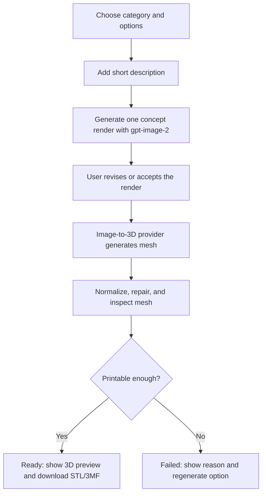
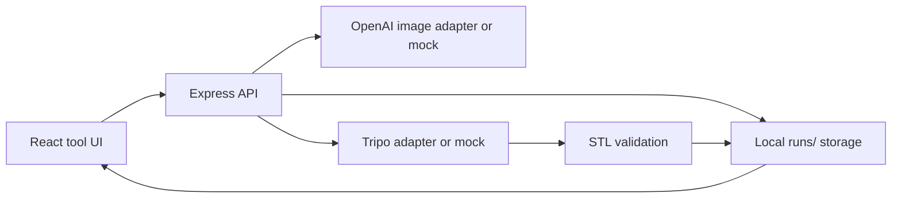

# 3D Printable Model Generation Demo Plan

## Goal

Build an independent demo project in `D:\Code\Toni\航模` for generating static 3D printable models from guided user input.

The demo proves this flow:

1. The user chooses a model category and fixed options.
2. The user adds one short natural-language description.
3. The system uses `gpt-image-2` to generate one polished concept render.
4. The user can revise that concept with natural-language instructions before sending it to 3D generation.
5. The system sends the selected image, and later optional multi-view references, to an image-to-3D provider.
6. The system exports printable files.
7. The system returns only `Ready` or `Failed`.
8. `Ready` models can be downloaded as `STL`, with `3MF` added when provider support is stable.

## Non-Goals

- No login, membership, payment, order, or fulfillment flow in the demo.
- No real flight/RC/aerodynamic/structural parts.
- No engineering CAD guarantee.
- No arbitrary full-color texture printing.
- No stickers.
- No moving joints or mechanical assemblies.
- No real brand logos, weapon realism, or unsafe child-facing content.

## Target User

Children and families designing personalized static models.

The first version focuses on fun and printable toy-like objects, not manufacturing-grade parts.

## Model Categories

- Vehicles
  - race car
  - off-road vehicle
  - futuristic sports car
- Aircraft
  - jet
  - biplane
  - space fighter
- Ships
  - warship
  - sailboat
  - vintage ship

## Color Policy

Color is constrained, not explored as a primary feature.

- Use few colors.
- Prefer large printable color zones.
- Avoid gradients, photo textures, and dense surface patterns.
- Demo may output single-color `STL` first.
- Multi-color output should use `3MF` or separated geometry parts, not image textures.

## Product Flow



## Status Model

Only two public statuses exist:

- `Ready`
- `Failed`

No `Experimental` state in the user-facing demo.

Internally, the report can keep detailed failure reasons.

Example:

```json
{
  "status": "Failed",
  "reasons": ["download_missing_stl", "bambu_slice_failed"]
}
```

## Technical Route

### Image Generation

Use OpenAI `gpt-image-2` for one polished concept render, then use image edit requests for natural-language revisions.

Prompt constraints:

- white or clean studio background
- toy-like hard-surface model
- clear silhouette
- limited colors
- no transparent parts
- no tiny fragile antennas
- no fine loose cables
- no real brand logos
- no realistic weapon emphasis

### Image-To-3D Provider

Primary provider candidate:

- Tripo Image to 3D
  - strong first candidate because API output supports `stl` and `3mf`

Backup provider candidate:

- Hyper3D Rodin
  - useful for multi-image input and `stl` output

Benchmark later:

- Tripo

### File Pipeline

Planned run folder:

```text
runs/{runId}/
  input.json
  preview-a.png
  preview-b.png
  selected.png
  provider-response.json
  model.glb
  model.stl
  model.3mf
  report.json
```

### Mesh Validation

The demo should check:

- output file exists
- file size is plausible
- mesh has vertices and faces
- bounding box can be normalized to target size
- obvious floating fragments are removed or fail the job
- model can be loaded by local mesh tooling
- optional: Bambu Studio can open or slice the file

The first validation implementation can be conservative. If the script cannot prove the file is usable, mark it `Failed`.

## Frontend Demo

The first screen is the usable tool, not a marketing landing page.

Views:

1. Input panel
2. Two generated render choices
3. Generation progress
4. 3D preview and download
5. Failed state with reasons and retry

Expected controls:

- category segmented control
- subtype buttons
- style options
- limited color choices
- text prompt
- generate button
- image selection
- 3D viewer
- download buttons

## Backend API Shape

Suggested endpoints:

```text
POST /api/concepts
POST /api/models
GET  /api/runs/:runId
GET  /api/runs/:runId/download/stl
GET  /api/runs/:runId/download/3mf
```

## Environment Variables

```text
OPENAI_API_KEY=
TRIPO_API_KEY=
OPENAI_BASE_URL=https://testvideo.site/v1
OPENAI_IMAGE_MODEL=gpt-image-2
TRIPO_BASE_URL=https://api.tripo3d.ai/v2/openapi
```

## Success Criteria

The demo is successful when:

1. A user can create a vehicle, aircraft, or ship prompt from guided options.
2. The app generates one concept image.
3. The user can revise or accept the concept image.
4. The app calls an image-to-3D provider and stores the result.
5. The app shows `Ready` or `Failed`.
6. A `Ready` run exposes an `STL` download.
7. At least three sample prompts are tested end to end.
8. At least one sample can be opened in Bambu Studio or another slicer.

## Main Risks

### Risk 1: Image-to-3D output is not printable

Mitigation:

- constrain prompts heavily
- use toy-like shapes
- avoid thin details
- add validation and fail closed

### Risk 2: Provider latency makes the demo feel broken

Mitigation:

- show explicit progress states
- poll run status
- persist run files

### Risk 3: The generated model does not match the selected render closely enough

Mitigation:

- use clean single-object renders
- later add multi-view reference generation
- keep user promise as "inspired by the selected design"

### Risk 4: Multi-color output adds complexity too early

Mitigation:

- start with single-color `STL`
- add `3MF` only after the basic pipeline works

## Recommended Build Order

1. Scaffold independent web app.
2. Implement local run storage.
3. Implement concept generation with mock fallback.
4. Implement image selection and run state.
5. Implement Tripo provider adapter.
6. Implement STL download.
7. Implement mesh validation report.
8. Add 3D preview.
9. Add Bambu/slicer verification hook if available.
10. Add `3MF` support after `STL` works.

## Approval Gate

Before coding, confirm:

- This demo scope is accepted.
- The first provider should be Tripo.
- The first printable output should be single-color `STL`.
- `3MF` is a follow-up after the basic pipeline works.

## Engineering Review

### Scope Decision

Build the demo as a self-contained Vite React app with a small Node/Express API.

### Architecture



### Implementation Choices

- Use local file storage instead of a database.
- Use mock providers by default so the demo runs without API keys.
- Use `OPENAI_API_KEY` and `TRIPO_API_KEY` only when present.
- Keep public status to `Ready` or `Failed`.
- Keep internal failure reasons in `report.json`.
- Use Three.js in the frontend for a live 3D preview.

### NOT in Scope

- Job queue and background workers: useful later, unnecessary for local demo.
- User accounts: deferred until this becomes part of the existing website.
- Payment and membership: explicitly deferred.
- 3MF multi-color authoring: follow-up after STL path works.
- Automated Bambu Studio slicing: follow-up if local slicer path is available.

### Failure Modes

| Codepath | Failure Mode | Handling |
| --- | --- | --- |
| Concept generation | Missing OpenAI key | Use mock concepts |
| Concept generation | OpenAI error | Return visible API error and keep form usable |
| Model generation | Missing Tripo key | Use mock STL |
| Model generation | Tripo timeout | Mark `Failed` with reason |
| File download | STL missing | Return 404 and visible failed state |
| STL validation | Geometry cannot be parsed | Mark `Failed` |

### Test Strategy

- `npm run build` must pass.
- `npm run typecheck` must pass.
- Manual browser QA must cover concept generation, concept selection, model generation, `Ready`, `Failed`, and STL download.
