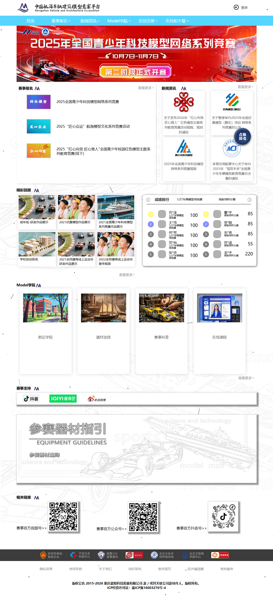
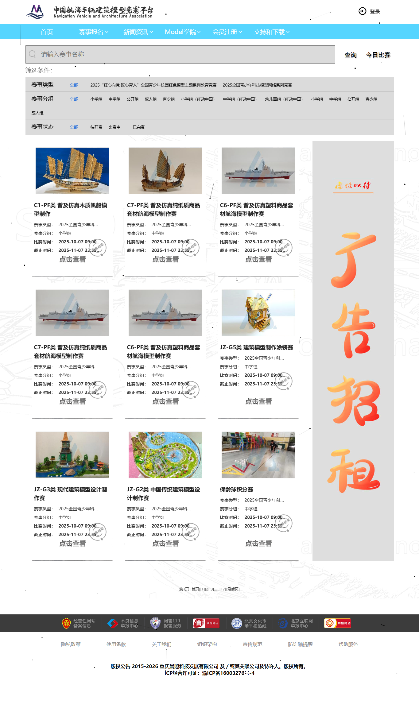
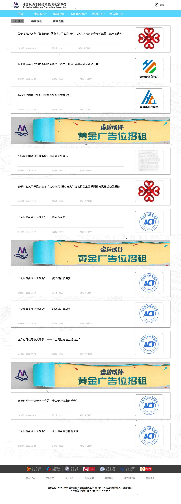
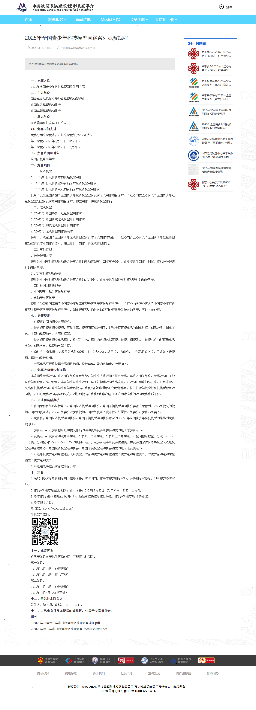
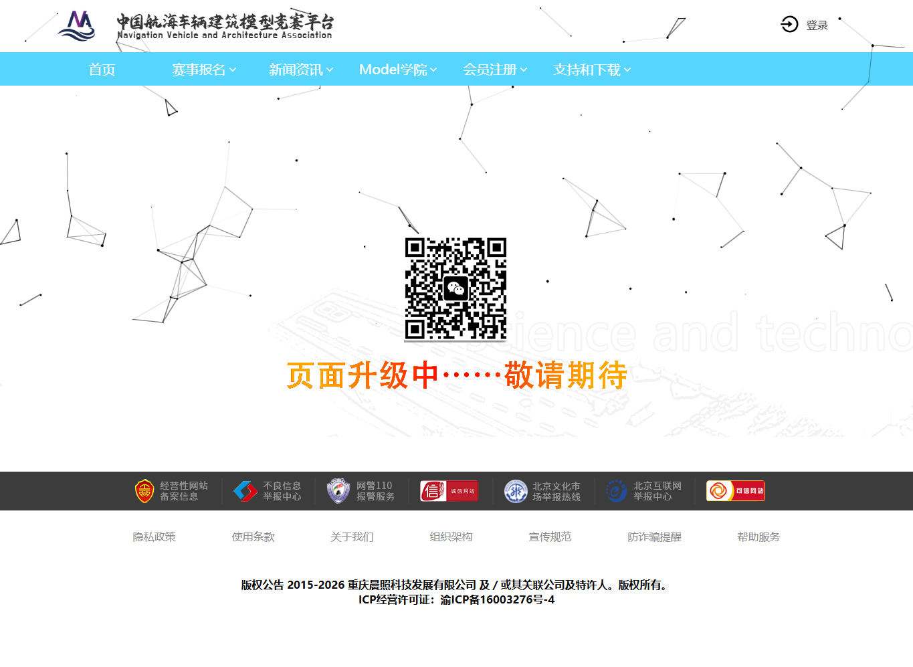
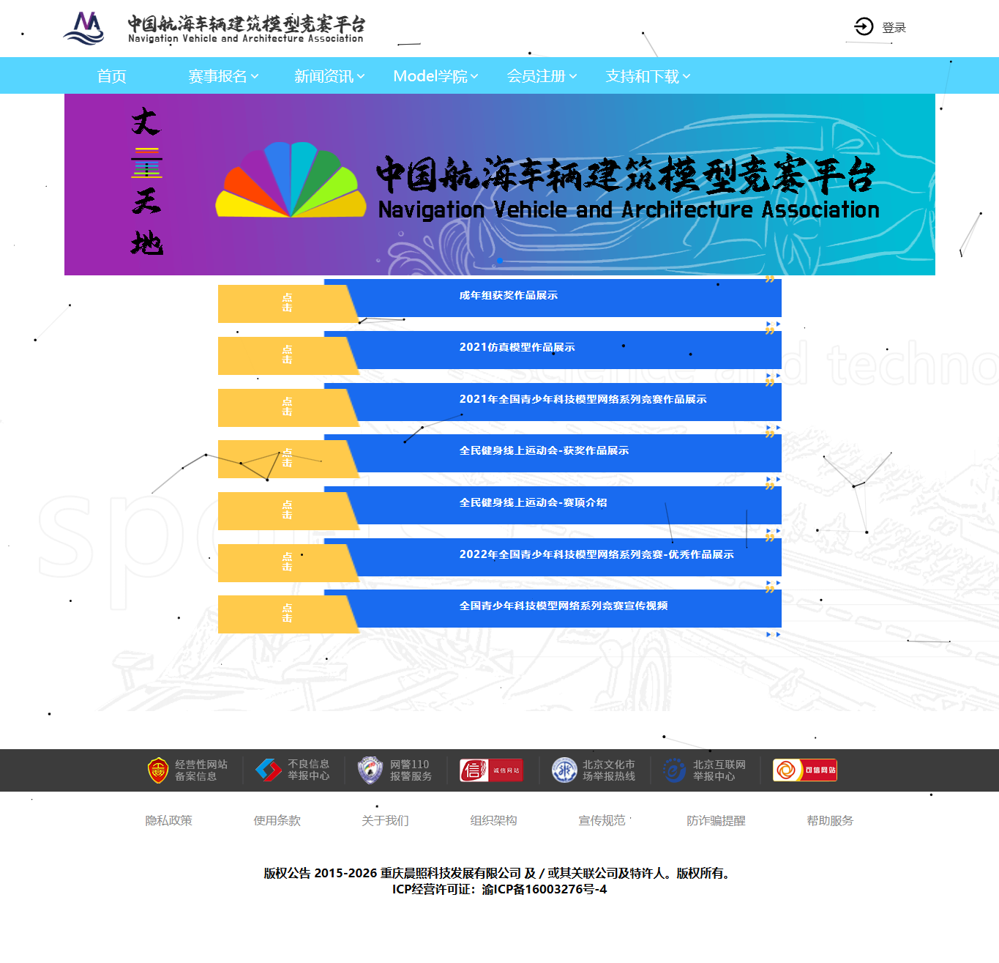
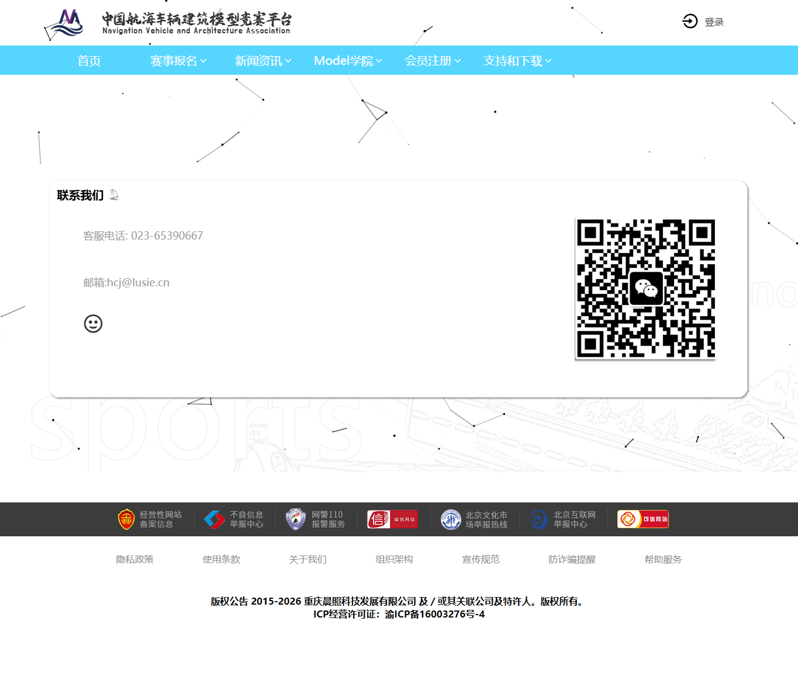

# Lusie 公开展示层设计改版 Brief

本文档给前端设计同事使用，目标是基于当前 `lusie.cn` 公开展示层截图，明确每个页面的现状问题和改版方向。

## 改版目标

把当前网站从“老式活动信息页面集合”升级成“中国航模赛事服务入口”。

用户进入网站后，应该能快速完成四件事：

1. 找到当前可报名赛事。
2. 看懂怎么报名。
3. 找到规则、下载资料、成绩和证书入口。
4. 知道遇到问题联系谁。

## 设计总原则

- 优先服务任务完成，而不是堆视觉效果。
- 首页要像赛事服务调度台，不像所有模块的堆叠。
- 移动端优先检查，不能只是桌面缩放。
- 不允许核心卡片链接到“页面升级中”。
- 官方通知、成绩公告、下载资料必须分清楚。
- 保留老业务系统入口，但在视觉上说明“将跳转到报名/登录系统”。

## 全局问题

1. **主路径不清楚**
   当前首页有赛事报名、新闻、回顾、排行、学院、支持、二维码，但用户最关键的报名/规则/成绩路径没有形成明确优先级。

2. **移动端体验弱**
   多数页面是桌面宽度缩放，信息密度和点击区域不适合手机。

3. **内容承诺和实际页面不一致**
   `Model学院` 在首页占重要位置，但入口进入后是“页面升级中”。

4. **内容老旧**
   精彩回顾出现 2021/2022 内容，容易让用户感觉平台维护不足。

5. **下载和公告混杂**
   下载中心本质还是文章列表，PDF/资料入口不够直接。

6. **静态页太薄**
   隐私政策、组织架构、宣传规范、防诈骗提醒等页面内容不足，有的接近空页。

7. **视觉噪音偏多**
   背景粒子、装饰线、阴影、二维码墙、旧式图标混用，削弱官方赛事平台的可信感。

---

## 页面 1：首页

当前截图：

移动端截图：

### 现状问题

- 首屏 banner 很强，但主行动不够清楚。
- “赛事报名”和“新闻资讯”并列，但用户更需要先看到“立即报名 / 查看规则 / 报名指南”。
- 新闻卡片图片和标题重复感强，缺少日期、类型和优先级。
- 精彩回顾内容偏旧。
- 成绩排行区域视觉存在，但业务意义不够解释。
- Model 学院四个卡片很好看，但入口实际多数未建设完成。
- 赛事支持区域像外链墙，不像官方支持体系。
- 二维码区域占位大，但缺少“为什么扫码”的说明。

### 修改点

**P0**

- 首屏重构为“当前主赛事 + 立即报名 + 查看规则 + 报名指南”。
- 增加快捷入口：赛事报名、规则下载、成绩查询、证书查询、联系客服。
- 首页只保留真实可用入口，不再链接到空页面。
- 移动端单独设计信息顺序，不使用桌面压缩。

**P1**

- 新闻区域拆成“官方通知 / 赛事资讯 / 成绩公示”。
- 当前赛事区域改为状态卡片，展示报名中、比赛中、已完赛。
- 精彩回顾改为“优秀作品 / 赛事回放”，优先使用近两年内容或常青内容。
- Model 学院改成轻量实用入口：入门指南、项目介绍、器材建议、作品案例。

**P2**

- 减少粒子背景和散点装饰。
- 赛事支持改成“官方媒体矩阵 / 合作平台 / 服务支持”。
- 二维码区域压缩并增加说明文案。

---

## 页面 2：赛事报名列表 / 赛事中心

当前截图：

### 现状问题

- 筛选项很多，但层级和可读性弱。
- 搜索、今日比赛、筛选条件之间没有形成清楚的任务流。
- 赛事卡片信息完整，但视觉扫描效率低。
- “点击查看”不像正式 CTA。
- 右侧竖幅广告占位过大，抢走核心赛事列表注意力。
- 分页是老式文本分页，不适合移动端。

### 修改点

**P0**

- 改名为“赛事中心”，弱化“报名列表”的后台感。
- 顶部设置状态 Tab：全部、正在报名、比赛中、已完赛、即将开始。
- 筛选分组：赛事类型、模型类别、参赛组别、时间。
- 赛事卡片明确显示：状态、比赛时间、截止时间、组别、规则、报名/查看详情。
- CTA 改为明确按钮：`查看详情`、`报名入口`、`查看规则`。

**P1**

- 移除或大幅弱化右侧广告位。
- 分页改为现代分页或加载更多。
- 赛事卡片加入“需要登录报名”的提示。

**P2**

- 支持结果为空状态。
- 增加“老师/机构组织报名”提示入口。

---

## 页面 3：赛事详情

当前截图：

### 现状问题

- 页面信息很重要，但展示像后台详情页。
- 顶部“请先登录，再去报名”不够友好，也不解释为什么。
- 证书、成绩、获奖名单、规则放在同一页，但结构不清楚。
- 获奖名单表格可以用，但在移动端会很难读。
- 报名动作不突出。

### 修改点

**P0**

- 顶部做赛事概要区：赛事名称、状态、时间、组别、类型、主办/承办、报名按钮。
- 对需要登录的动作增加解释：`登录后可报名/查看个人成绩/下载证书`。
- 规则、报名、成绩、证书拆成清楚模块。
- 老系统报名作为明确交接按钮：`进入报名系统`。

**P1**

- 获奖名单表格移动端改为卡片或横向表格容器。
- 增加附件/规则下载模块。
- 增加“相关通知”模块。

**P2**

- 可以增加赛事图片、优秀作品、常见问题联动。

---

## 页面 4：新闻公告列表

当前截图：

### 现状问题

- 新闻列表视觉间距大，但信息密度不高。
- 今日推荐、赛事资讯、赛事直播混在一级 Tab，逻辑不统一。
- 列表中穿插广告位，打断阅读。
- 旧文章和新公告混排，时间跨度大。
- 卡片右侧图片有些只是 logo，信息增量小。

### 修改点

**P0**

- 改成“新闻公告中心”。
- 分类调整为：官方通知、赛事资讯、成绩公示、资料下载、媒体回顾。
- 每条内容展示：标题、日期、分类、摘要、附件标记。
- 官方通知和成绩公示需要明显标签。

**P1**

- 广告位从列表中移除，或移到侧边弱区域。
- 列表支持按年份/赛事筛选。
- 置顶重要公告。

**P2**

- 增加搜索。
- 增加附件筛选：只看 PDF/规则/报名指南。

---

## 页面 5：新闻详情 / 赛事规程详情

当前截图：

### 现状问题

- 正文可读性尚可，但页面官方感不足。
- 右侧“24小时热闻”对赛事平台意义不大，像资讯站模板。
- 长规程内容没有目录，用户难以快速找到报名、规则、时间、附件。
- 附件入口在长文末尾，发现成本高。

### 修改点

**P0**

- 详情页顶部展示标题、发布时间、来源、分类。
- 如果文章含附件，顶部就显示附件下载卡片。
- 长规程文章增加目录锚点：比赛名称、主办单位、时间、项目、报名、成绩、附件。
- 右侧改为“相关通知 / 相关下载 / 相关赛事”，不要叫“24小时热闻”。

**P1**

- 正文排版增强：标题层级、段落宽度、表格样式、附件样式。
- 移动端增加顶部附件快捷按钮。

**P2**

- 增加复制链接、打印/PDF 友好样式。

---

## 页面 6：下载中心

当前截图：

### 现状问题

- 下载中心仍是文章列表，不像资料库。
- 资料数量少但被新闻模板包裹，用户需要点进去再下载。
- 右侧 24 小时热闻与下载任务无关。

### 修改点

**P0**

- 下载中心改为资料卡片/表格。
- 每条资料直接显示：资料名称、所属赛事、发布日期、文件类型、下载按钮。
- 分类：报名指南、竞赛规则、成绩公示、操作手册、宣传资料。

**P1**

- 支持按赛事筛选。
- 支持只看最新资料。

**P2**

- 增加文件大小、下载次数或更新时间。

---

## 页面 7：报名指南

当前截图：

### 现状问题

- 内容有价值，但更像长篇宣传说明。
- 参赛建议、能力评分、赛事介绍混在一起，用户很难快速完成“我要报名”的任务。
- 页面视觉与其他页面差异大。
- 两个“点我去报名”按钮位置分散。

### 修改点

**P0**

- 改成步骤式指南：
  1. 注册/登录账号
  2. 选择赛事
  3. 阅读规则和准备材料
  4. 上传作品或报名资料
  5. 等待审核/评审
  6. 查询成绩/下载证书
- 顶部放报名入口和操作手册下载。
- 把“选什么项目适合我”单独做成推荐模块。

**P1**

- 把赛事介绍转移到 Model 学院或赛事分类页。
- 增加常见问题入口。

**P2**

- 可做成图文流程或短视频教程入口。

---

## 页面 8：Model 学院空页面

当前截图：

### 现状问题

- 首页和导航都强推 Model 学院，但落地页是“页面升级中”。
- 这会直接损伤用户信任。
- 二维码不解释用途。

### 修改点

**P0**

- 不能再作为主要入口落到空页。
- 如果功能未完成，必须先做轻量可用页：
  - 我适合参加什么项目？
  - 各模型项目介绍
  - 入门器材建议
  - 优秀作品案例
  - 常见问题

**P1**

- 在线课程、附近机构、器材选择可以标记为“后续上线”，但不能占主视觉。

**P2**

- 后续再扩展课程、机构地图、商城和社区。

---

## 页面 9：赛事科普 / 回顾页

当前截图：

### 现状问题

- 页面内容偏视频列表，但标题入口叫赛事科普。
- 多个内容仍是 2021/2022，时间感老。
- “点击”作为行动文案太弱。

### 修改点

**P0**

- 明确页面定位：如果是科普，就做项目介绍；如果是回顾，就做作品/视频库。
- 视频卡片显示标题、年份、赛事、类型。
- 行动文案改为 `观看视频`、`查看作品`。

**P1**

- 优先展示近年内容或常青内容。
- 增加模型分类筛选。

**P2**

- 可和 Model 学院合并为“学习与作品”。

---

## 页面 10：关于我们

当前截图：

### 现状问题

- 页面视觉比其他静态页完整，但文案存在较强宣传口吻。
- 部分表述需要核实，例如“全球最大”“全球首个”等。
- 两张大卡片内容好，但没有行动入口。

### 修改点

**P0**

- 文案改成官方、克制、可验证。
- 增加组织介绍、平台职责、服务对象、联系方式。
- 对未经确认的绝对化表达谨慎处理。

**P1**

- 增加赛事体系、协会/平台关系说明。
- 增加学校/机构合作入口。

**P2**

- 可加入发展时间线和合作单位。

---

## 页面 11：联系我们

当前截图：

### 现状问题

- 信息太少。
- 电话、邮箱、二维码有，但没有服务时间、问题类型和处理路径。
- 卡片空间利用不足。

### 修改点

**P0**

- 增加服务时间。
- 按问题类型给联系方式：报名问题、账号问题、器材服务、机构合作。
- 二维码说明用途。

**P1**

- 增加常见问题入口。
- 增加“提交问题/联系表单”的后续入口，第一期可先不做表单。

---

## 页面 12：隐私政策 / 静态政策页

当前截图：

### 现状问题

- 页面内容非常薄，只有附件下载。
- 作为政策页不够正式。
- 视觉上像临时页面。

### 修改点

**P0**

- 政策页必须直接展示正文，而不是只有附件。
- 附件可以保留为下载。
- 页面应有标题、更新时间、适用范围。

**P1**

- 组织架构、宣传规范、防诈骗提醒也要补齐正文。

---

## 页面 13：机构后台登录

当前截图：

### 现状判断

这是老业务系统，不属于第一期重做范围。

### 修改点

**P0**

- 新前端只需要提供清楚入口：`机构登录`。
- 点击后明确跳转老系统。

**P1**

- 如果要统一观感，可后续单独做后台登录页视觉改造。

---

## 第一版设计交付清单

设计同事建议输出：

1. 首页桌面版。
2. 首页移动版。
3. 赛事中心桌面版。
4. 赛事中心移动版。
5. 赛事详情桌面版。
6. 赛事详情移动版。
7. 新闻公告列表。
8. 新闻详情。
9. 下载中心。
10. 报名指南。
11. FAQ。
12. Model 学院轻量版。
13. 关于我们。
14. 联系我们。
15. 政策页模板。

## 优先级总表

| 优先级 | 必须解决的问题 |
|---|---|
| P0 | 首页主路径、赛事中心、赛事详情、报名指南、移动端、空页面、旧系统交接 |
| P1 | 新闻分类、下载中心资料化、FAQ、Model 学院轻量内容、联系页服务路径 |
| P2 | 作品库、媒体矩阵、时间线、搜索、更多内容筛选 |

## 设计验收标准

- 用户打开首页 10 秒内能找到当前赛事。
- 用户 15 秒内能找到规则下载。
- 用户不用问客服也能理解报名流程。
- 移动端没有横向滚动。
- 首页没有入口跳到“页面升级中”。
- 新闻、通知、成绩、下载在视觉上清楚分离。
- 老系统跳转入口不让用户困惑。
- 页面整体像官方赛事服务平台，而不是临时活动站。
